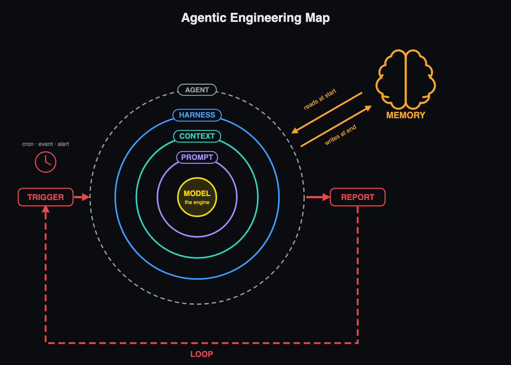

# The Agentic Engineering Map — find the broken layer

Agent = model + harness. It runs tools in a loop to reach a goal.
When it fails, find the layer before you touch anything. Most people go back to the prompt; the problem is usually further out.

| You see | Layer | Do this |
|---|---|---|
| A paragraph when you asked for a list. JSON with a sentence in front, and your parser dies. | **Prompt** | One clear job per call, and what done looks like. One or two examples of the quality you expect. For code that reads the answer: ask for JSON, give the schema, parse it. |
| It fails the same way however you reword the prompt. | **Prompt → outgrown** | Stop polishing the wording. Change what the harness loads: the CLAUDE.md / AGENTS.md, the skills. |
| An hour in, it forgets the file you gave it, asks what you already answered, makes mistakes it didn't make at the start. | **Context** | Curate the window: key facts at the start or the end, not the middle. Keep three lines of a tool output, drop the log. Big stuff in files it reads on demand. Research to a subagent. If the session has gone bad, reset (the five reset rules). |
| No tool for the system, so it guesses an API from memory, queries the database with a raw string, or ignores your codebase's conventions. | **Harness** | Give it the real interface: an MCP server, the CLI, the database client. For systems it doesn't have: "no tool for it → stop and ask". |
| It says done while the tests are red. | **Harness · verification** | Checks it can't skip: a hook that runs the tests, a linter, a CI gate that blocks the merge. |
| It figures out yesterday's fix again, for the third time this week. | **Memory** | Write it down: decisions, gotchas, facts that aren't in the code. A file in git, next to the code. The agent writes it at the end of the run; you review the diff. |
| You type, read, correct, type again. You can't leave your chair. | **Loop** | A trigger starts the run (cron, event, alert). Put in a stop it can't fake: a run cap and a token budget, a no-progress check, a completion check (tests, or a separate model). |
| You click "yes" without reading. It reads web pages, issues, emails, READMEs you never wrote. | **Boundary** | Draw the boundary once, then run full speed inside it: a dev container, or a separate machine. Keep secrets out. A network allowlist. It asks before merge, delete, send. Git is the undo. |
| Which engine for this job? | **Model** | Heavy work (a refactor, a bug across ten files): the strongest closed model. Everyday work: a free one is enough. Under NDA: local. Free cloud engines may train on your prompts. The ranking changes every week — check again. |

**The one line per layer:** prompt = what you type · context = what you hand it · harness = where it works · memory = what it remembers tomorrow · loop = how it keeps going without you.

---
From the **AI Agent Engineer** course — [aiagentengineer.dev](https://aiagentengineer.dev). Each layer is a module: harness M2, verification M3–M4, memory M5, tools M6, loops M7–M8.
