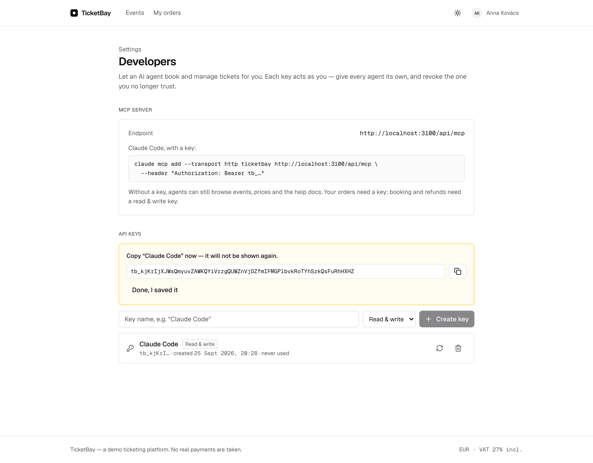
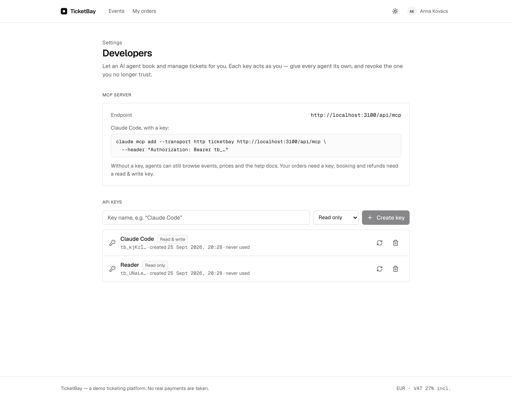
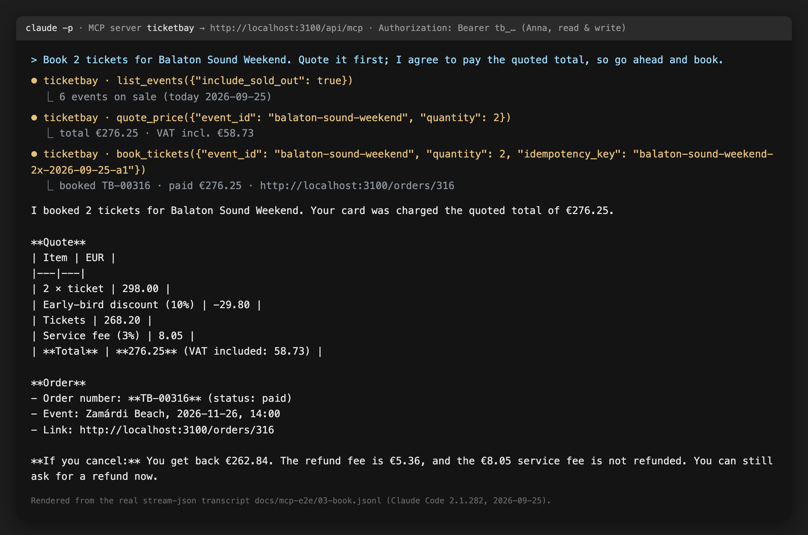
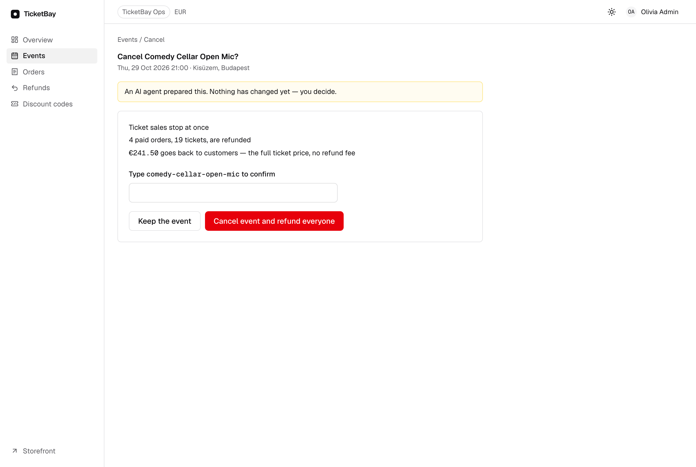

# TicketBay MCP — end-to-end proof (2026-09-25)

Every run below is a real `claude -p` session (Claude Code 2.1.282) against TicketBay on
`localhost:3100`, with `--strict-mcp-config` so the agent sees **only** TicketBay's MCP
server. Full transcripts (stream-json, API keys redacted) are in [`mcp-e2e/`](mcp-e2e/);
the quotes here are cut from them. One demo customer (Anna) plus the admin.

Setup, once:

```bash
npm run db:up && npm run db:migrate && npm run db:seed
PORT=3100 BETTER_AUTH_URL=http://localhost:3100 npm run dev
# seed: "demo accounts (password "ticketbay-demo"): anna@ticketbay.test, admin@ticketbay.test (admin)"
```

Keys were created in the UI, **Settings → Developers**, signed in as Anna:
"Claude Code" (**Read & write**) and "Reader" (**Read only**); the admin made "Ops agent"
(Read & write). Each secret is shown once:




The remote configs are plain JSON with the key as a header:

```json
{"mcpServers":{"ticketbay":{"type":"http","url":"http://localhost:3100/api/mcp",
  "headers":{"Authorization":"Bearer tb_…"}}}}
```

## 1. Local stdio server: "what concerts are on next month under 50 euros?"

```bash
# mcp.json: {"mcpServers":{"ticketbay-local":{"type":"stdio","command":"npx",
#   "args":["--prefix","<repo>","tsx","<repo>/mcp/server.ts"]}}}
claude -p "What concerts are on next month under 50 euros?" \
  --mcp-config mcp.json --strict-mcp-config --allowedTools "mcp__ticketbay-local__*"
```

```
TOOL CALL: list_events {"category": "concert", "from": "2026-10-01", "to": "2026-10-31", "max_price_eur": 50}
TOOL CALL: quote_price {"event_id": "midnight-arcade-neon-tour", "quantity": 1}
TOOL CALL: get_event {"event_id": "midnight-arcade-neon-tour"}
FINAL: In October 2026, TicketBay has one concert under €50:
**Midnight Arcade — Neon Tour** — Wed, 7 October 2026, 20:00, Budapest Park.
€45 per ticket. The 3% service fee brings one ticket to **€46.35**, VAT included. 120 of 300 seats are left.
```

`list_events` returns today's date, so the agent resolved "next month" itself. →
[`01-local.jsonl`](mcp-e2e/01-local.jsonl)

## 2. search_docs: "how do refunds work for early-bird tickets?"

Same local server, no key (search_docs is public):

```
TOOL CALL: search_docs {"query": "refund early-bird tickets", "limit": 3}
FINAL: TicketBay refunds an early-bird ticket like any other ticket. The refund uses the discounted price that you paid.
- Refund amount: the early-bird price you paid, minus a 2% refund fee (minimum €0.50).
- TicketBay does not take the early-bird discount back when you cancel, and does not add it to your refund.
- Refund window: until the event starts. The service fee is not refunded.
Example: €45.00 early-bird ticket → €45.00 − €0.90 = €44.10.
Source: help/refund-policy.md, help/early-bird-and-discounts.md
```

The top hit is the "Refunds for early-bird tickets" section of
[`help/refund-policy.md`](../help/refund-policy.md); the €44.10 example is what
`refund_order` really pays (pinned by `tests/integration/mcp-key-scopes.test.ts`). →
[`02-docs.jsonl`](mcp-e2e/02-docs.jsonl)

## 3. Remote /api/mcp with Anna's read & write key: book, list my orders, refund

```bash
claude -p "Book 2 tickets for Balaton Sound Weekend. Quote it first; I agree to pay the quoted total, so go ahead and book." \
  --mcp-config mcp.json --strict-mcp-config --allowedTools "mcp__ticketbay__*"
claude -p "List my orders." --continue …
claude -p "Refund order TB-00316 now. Yes, I accept the refund amount you showed." --continue …
```

```
TOOL CALL: list_events {"include_sold_out": true}
TOOL CALL: quote_price {"event_id": "balaton-sound-weekend", "quantity": 2}
  → 2 × ticket €298.00 · Discount 10% (early-bird 10%) −€29.80 · Tickets €268.20 · Total €276.25
TOOL CALL: book_tickets {"event_id": "balaton-sound-weekend", "quantity": 2, "idempotency_key": "balaton-sound-weekend-2x-2026-09-25-a1"}
  → {"booked": true, "order_number": "TB-00316", …}
FINAL: I booked 2 tickets for Balaton Sound Weekend. Your card was charged the quoted total of €276.25.

TOOL CALL: my_orders {}
FINAL: You have 5 orders … | TB-00316 | Balaton Sound Weekend | 2026-11-26 14:00 | 2 | 276.25 | paid | 262.84 |

TOOL CALL: refund_order {"order_id": "TB-00316"}
  → {"refunded": true, "refunded_eur": 262.84, "refund_fee_kept_eur": 5.36, "seats_released": true, …}
FINAL: I refunded order TB-00316 … The refund is €262.84, the same amount I showed you before.
- Link: http://localhost:3100/orders/316
```

`refund_order` did the refund and returned the order page link. →
[`03-book.jsonl`](mcp-e2e/03-book.jsonl), [`04-orders.jsonl`](mcp-e2e/04-orders.jsonl),
[`05-refund.jsonl`](mcp-e2e/05-refund.jsonl)



*(Rendered from the stream-json transcript `03-book.jsonl`; `claude -p` has no terminal to
screenshot.)*

A first attempt, booking the Comedy Cellar Open Mic, was **refused by the agent**: it checked
`my_orders`, saw Anna already held 4 tickets for that show, and stopped before charging.

## 4. Key scopes: the read-only key lists events but is refused on booking

```bash
claude -p "Find the cheapest event on sale, then book 1 ticket for it. I agree to pay; go ahead." …   # "Reader" key
```

```
TOOL CALL: list_events {}                                    → 4 events on sale
TOOL CALL: quote_price {"event_id": "comedy-cellar-open-mic", "quantity": 1}
TOOL CALL: book_tickets {"event_id": "comedy-cellar-open-mic", "quantity": 1, …}
TOOL RESULT: ERROR Forbidden (403): book_tickets needs a key with the tickets:write scope, and this key is read-only.
             Create a read & write key under Settings → Developers if the customer wants the agent to do this.
FINAL: I found the cheapest event, but the booking failed. Your card was not charged.
```

→ [`06-readonly.jsonl`](mcp-e2e/06-readonly.jsonl)

## 5. cancel_event only returns a link; the human cancels

The admin's key:

```
claude -p "The Comedy Cellar Open Mic venue flooded. Cancel the event." …
TOOL CALL: cancel_event {"event_id": "comedy-cellar-open-mic"}
  → {"cancelled": false, "action_required": "A human must confirm this in the dashboard. Nothing has changed yet.",
     "impact_if_confirmed": {"paid_orders_refunded": 4, "tickets_refunded": 19, "refund_total_eur": 241.5},
     "confirm_url": "http://localhost:3100/admin/events/comedy-cellar-open-mic/cancel?via=mcp"}
FINAL: The event is **not cancelled yet** … Confirm here: http://localhost:3100/admin/events/comedy-cellar-open-mic/cancel?via=mcp
```

Database before the human acted: `cancelled_at_ms IS NULL`, `seats_sold = 19`. Then the admin
opened the link signed out → `/sign-in?next=%2Fadmin%2Fevents%2Fcomedy-cellar-open-mic%2Fcancel%3Fvia%3Dmcp`
→ the event's cancel page, typed the event id and clicked:



```
after confirming, url: http://localhost:3100/admin/events?cancelled=comedy-cellar-open-mic
banner: Comedy Cellar Open Mic is cancelled. Sales are closed and 4 orders are refunded, €241.50 in total.
db: cancelled = t, seats_sold = 0; refund_reason = event_cancelled: 4 orders, 24150 cents, 4 provider refund ids
```

→ [`07-cancel-event.jsonl`](mcp-e2e/07-cancel-event.jsonl),
[`07-cancel-confirm-browser.txt`](mcp-e2e/07-cancel-confirm-browser.txt)

## 6. Revoking the key stops the agent

Anna revoked "Claude Code" in Settings → Developers ("Reader" stays). The same session config again:

```
MCP servers: [{'name': 'ticketbay', 'status': 'failed'}]
FINAL: I can't list your orders right now. … The server rejected the API key with HTTP 401 ("Invalid API key").
dev log: POST /api/mcp 401
```

→ [`08-revoked.jsonl`](mcp-e2e/08-revoked.jsonl)

## One customer's key never sees another's orders

The demo has one customer, so this is proven in the tests, not on camera:
`tests/integration/mcp-route.test.ts` and `accounts-services.test.ts` (user B's key cannot
list or refund A's order by any id spelling; the order stays paid), plus the adversarial
lane. An earlier live run with a second customer is in the git history (commit `6dbea98`).

## OAuth "Connect"

Out of scope since the 2026-09-25 course decision (keys only). It was built and proven first:
Claude Code connected with CIMD on localhost, sign-in → consent → token → tools, and
Disconnect cut it off. Evidence: [`mcp-e2e/oauth/`](mcp-e2e/oauth/); code on the local branch
`app/v2-mcp-oauth`. Which clients need OAuth: [`mcp-client-auth-2026.md`](mcp-client-auth-2026.md).
